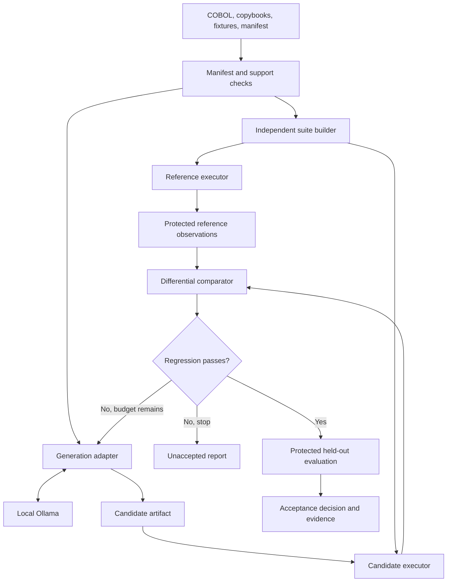

# Architecture

The CLI coordinates generation and validation. The generation engine proposes code; the validator owns execution evidence and the acceptance decision.

## Components and ownership

| Component | Responsibility | Owned artifacts |
| --- | --- | --- |
| CLI and orchestrator | Run lifecycle, attempt budget, diagnostics | Run metadata |
| Manifest loader | Input contract, path checks, configuration validation | Resolved manifest |
| Support checker | Compiler feasibility and unsupported dependencies | Support diagnostics |
| Suite builder | Fixtures and constrained generated cases, independent of translation | Cases, seeds, suite hashes |
| Reference executor | Compile and run original COBOL in the pinned environment | Reference observations |
| Generation adapter | Initial translation and bounded repairs through Ollama | Prompts, settings, candidates |
| Sandbox adapter | Isolated execution and resource enforcement | Execution records |
| Comparator | Exact observable comparison | Structured mismatches |
| Acceptance evaluator | Required gates and held-out isolation | Final outcome |
| Evidence store | Artifact retention, identity, and integrity | Run evidence bundle |

Ticket 01 implements plan validation and readiness checks. Ticket 02 adds the compare CLI, isolated Docker compilation/execution, exact comparator, and single-case evidence. Suite construction, model generation, and final acceptance remain planned boundaries. Use simple interfaces rather than a plugin framework.

## Generation interface

The request contains the supported COBOL source, copybooks, reviewed manifest, target runtime, and relevant visible regression diagnostics. The response contains candidate Python files and generation metadata. Validate paths and required entry points before execution.

Treat model output as a candidate artifact, not shell instructions. Generation has no authority to edit the validator, reference observations, frozen suites, acceptance policy, or source of truth. Give repairs only visible regression information. The independent test builder must not reuse candidate-written expectations.

No universal intermediate representation is required for the first release. A future parser or structured translator can replace or precede the generation adapter without changing the execution and comparison contract.

## Sandbox interface

Conceptually, execution accepts an immutable program artifact, a case, an environment profile, and resource limits. It returns an execution record with captured observables, termination cause, and collection status.

Compilation of user-supplied COBOL also needs controlled execution. Input mounts are read-only; writable outputs use per-execution directories. Each case starts from the same clean initial state for both languages. Validate extracted paths and prevent traversal, symlink escapes, and undeclared host mounts.

Use separate Linux containers with networking disabled, a non-root user where feasible, restricted capabilities, and no Docker socket inside program containers. Containers provide the chosen initial isolation boundary; stronger isolation can replace the adapter if the deployment threat model requires it.

A nonzero program exit can be a valid observable result when both runs complete normally and the case intentionally exercises an error path. Harness failure, timeout, signal termination, output truncation, and resource exhaustion must be represented separately from ordinary program exit codes. Equal failures alone do not establish a pass.

## Reference stability

Pin compiler and runtime identities and the compilation options. Repeat representative reference cases under identical conditions; the repeat count and coverage policy remain to be finalized. Record an unstable reference as inconclusive, preserving divergent observations.

Supply deterministic time or randomness through supported program inputs or controlled dependencies. If they cannot be controlled for a supported case, explain the limitation rather than silently stripping bytes from the comparison.

## Future network-profile interface

A profile describes allowed endpoints, dependency versions, initial state, reset behavior, response replay if used, and observable request/state comparison. Separate reference and candidate dependency instances prevent order-dependent interference.

Future adapters must define request ordering, concurrency, retry handling, secret injection, and state comparison before claiming network compatibility. The initial adapter supports only the disabled profile. Keeping the interface extensible is not equivalent to having implemented network support.

## Evidence boundaries

Separate generator-visible regression data from evaluator-only held-out data. Neither sandbox can read expected observations or acceptance reports during execution. The orchestrator computes hashes after every finalized artifact and records which immutable candidate was evaluated.

Hashes identify artifacts and detect later changes; they do not by themselves enforce access control or prevent a privileged local user from changing files. Access controls and isolated mount layouts supply the actual boundary.
